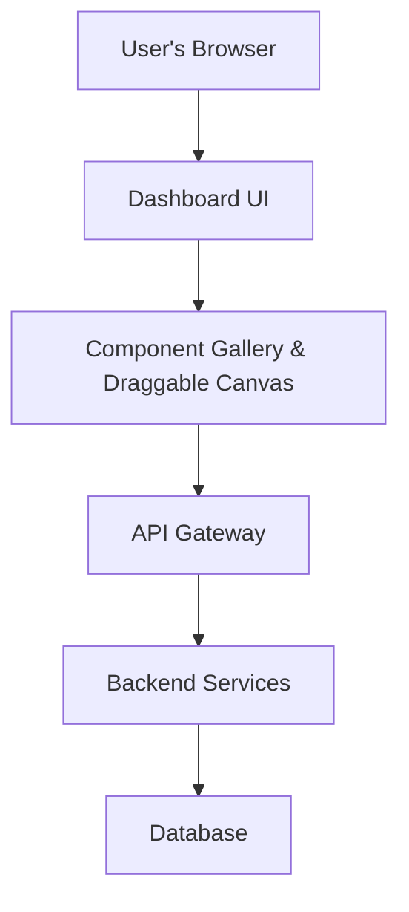
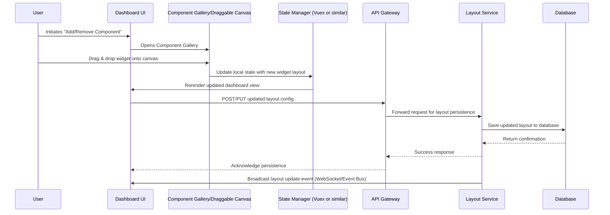

# Modular Ticketing System Specification

## Table of Contents

- [Overview](#overview)
- [Goals and Objectives](#goals-and-objectives)
- [Architecture](#architecture)
  - [High-Level Architecture Diagram](#high-level-architecture-diagram)
  - [Low-Level Architecture Diagram](#low-level-architecture-diagram)
- [System Components](#system-components)
  - [Frontend: Dashboard UI Application](#frontend-dashboard-ui-application)
  - [Backend: Python Services](#backend-python-services)
  - [Database](#database)
- [User Workflows and Data Flow](#user-workflows-and-data-flow)
  - [Component Gallery and Draggable Canvas](#component-gallery-and-draggable-canvas)
  - [State Management and Persistence](#state-management-and-persistence)
- [API Specification](#api-specification)
- [UI/UX Specifications](#uiux-specifications)
- [Security Considerations](#security-considerations)
- [Technologies and Libraries](#technologies-and-libraries)
- [Future Enhancements](#future-enhancements)
- [Appendix](#appendix)

## Overview

The **Modular Ticketing System** is designed to offer users a customizable dashboard for managing tickets, notifications, analytics, and more. The dashboard utilizes a **Component Gallery and Draggable Canvas** approach, allowing users to dynamically add, remove, and rearrange UI components. The backend is implemented in **Python** (leveraging frameworks like FastAPI or Flask), while the frontend is built with **Vue.js**.

## Goals and Objectives

- **Customizability:**  
  Allow users to tailor the dashboard by selecting and arranging components according to their preferences.

- **Modularity:**  
  Build the system in a modular way, enabling independent development, testing, and deployment of individual components/widgets.

- **Rapid Development:**  
  Leverage existing libraries and frameworks to accelerate development.

- **Scalability and Maintainability:**  
  Ensure that both frontend and backend architectures are scalable, and that state management and persistence can handle growing usage.

- **User Experience:**  
  Deliver an intuitive, responsive UI that enables seamless drag-and-drop interactions and real-time updates.

## Architecture

### High-Level Architecture Diagram

- **User's Browser:** Hosts the application.
- **Dashboard UI:** Provides the interface for user interactions.
- **Component Gallery & Draggable Canvas:** Manages the display and drag-and-drop of available widgets.
- **API Gateway:** Routes requests from the frontend to the appropriate backend service.
- **Backend Services:** Handles business logic, state updates, ticket management, notifications, and layout persistence.
- **Database:** Stores persistent data such as ticket details, user configurations, and layout states.

### Low-Level Architecture Diagram

## System Components

### Frontend: Dashboard UI Application

- **Component Gallery:**
  Displays a list of available widgets/components. Each component is represented by a card or icon that users can drag onto the canvas.
- **Draggable Canvas:**
  A flexible area (canvas) where users can drop components. Supports free-form arrangement or grid-based layout, depending on design needs.

- **State Management:**
  Use Vuex (or Vue Composition API with reactive state) to manage the current layout, widget configurations, and user interactions. Local persistence (e.g., localStorage) can be leveraged for immediate responsiveness before syncing with the backend.

### Backend: Python Services

- **API Gateway:**
  Routes HTTP requests to the appropriate services. Built using frameworks such as FastAPI or Flask with RESTful endpoints.

- **Layout Service:**
  A dedicated service to handle saving and retrieving dashboard layouts. Validates incoming data and ensures consistency.

- **Ticket Service:**
  Manages ticket CRUD operations, notifications, and related business logic.

- **Additional Services:**
  Depending on future requirements, services for analytics, reporting, and integrations with external systems (e.g., payment gateways, CRMs) can be added.

### Database

- **Persistent Data Store:**
  A relational (e.g., PostgreSQL) or NoSQL database that holds user configurations, ticket details, and application logs.
- **Data Models:**
  Define models for User, Layout, Ticket, Notification, etc. Ensure relationships and constraints are well-specified to maintain data integrity.

## User Workflows and Data Flow

### Component Gallery and Draggable Canvas

1. **Accessing the Gallery:**

   - The user opens the Component Gallery from the dashboard.
   - The gallery lists all available components/widgets.

2. **Dragging and Dropping Components:**

   - The user selects a widget and drags it onto the canvas.
   - The canvas provides real-time feedback (e.g., placement, snapping to grid).

3. **Updating Layout:**
   - Once a component is placed, the Dashboard UI state is updated to reflect the new configuration.
   - The updated layout is re-rendered immediately for visual confirmation.

### State Management and Persistence

- **Local State:**
  Managed via Vuex or the Composition API, ensuring quick responsiveness.
- **Backend Sync:**
  - After local state updates, an API call is triggered to persist the new layout.
  - The Layout Service validates and stores the updated configuration in the database.
- **Conflict Resolution:**
  - Implement versioning or timestamp checks to manage concurrent updates.
  - Optionally, use real-time notifications (e.g., via WebSocket) to update multiple sessions.

## API Specification

### Layout Endpoints

- **GET /api/layout/{userId}**
  Retrieves the saved layout configuration for the given user.

  - **Response:** JSON object with widget positions, settings, and configuration metadata.

- **POST /api/layout/{userId}**
  Creates a new layout configuration for the user.

  - **Payload:** JSON object with initial layout details.
  - **Response:** Confirmation and stored layout metadata.

- **PUT /api/layout/{userId}**
  Updates the existing layout configuration.

  - **Payload:** JSON object with updated layout configuration.
  - **Response:** Confirmation of update.

- **DELETE /api/layout/{userId}/{widgetId}**
  Removes a specific widget from the user’s layout.
  - **Response:** Confirmation of deletion.

### Ticket Endpoints

- **GET /api/tickets**
  Retrieves a list of tickets.
- **POST /api/tickets**
  Creates a new ticket.
- **PUT /api/tickets/{ticketId}**
  Updates an existing ticket.
- **DELETE /api/tickets/{ticketId}**
  Deletes a ticket.

> _(Additional endpoints for notifications, analytics, etc., can be added as required.)_

## UI/UX Specifications

- **Dashboard Layout:**
  - A clean and responsive design.
  - Support for drag-and-drop interactions with smooth animations and visual feedback.
- **Component Gallery:**
  - Easily accessible via a side panel or modal.
  - Icons and brief descriptions for each widget.
- **Draggable Canvas:**
  - Supports grid-based or free-form widget placement.
  - Features like snapping, resizing, and alignment guides.
- **Customization:**
  - Users can modify widget settings (e.g., size, color, data sources) through context menus or inline editors.
- **Responsiveness:**
  - UI should be responsive across devices, ensuring a consistent experience on desktops, tablets, and mobile devices.

## Security Considerations

- **Authentication & Authorization:**

  - Implement secure user authentication (e.g., JWT, OAuth2).
  - Role-based access control for different functionalities (admin, user, guest).

- **Data Validation:**

  - Ensure robust input validation both on the frontend and backend.
  - Sanitize all user inputs to prevent injection attacks.

- **Secure API Communication:**

  - Use HTTPS for all API calls.
  - Rate-limit sensitive endpoints to mitigate brute-force attacks.

- **State Integrity:**
  - Implement versioning and conflict resolution for concurrent updates.
  - Log all changes for audit and rollback purposes.

## Technologies and Libraries

- **Frontend:**

  - **Vue.js:** Main framework for building the UI.
  - **Vuex/Composition API:** For state management.
  - **Drag-and-Drop Libraries:**
    - Consider libraries like [Vue Draggable](https://github.com/SortableJS/Vue.Draggable) for implementing drag-and-drop functionality.
  - **CSS Framework:** (Optional) Tailwind CSS or Bootstrap Vue for rapid UI styling.

- **Backend:**

  - **Python:** Primary programming language.
  - **Framework:** FastAPI or Flask for RESTful API development.
  - **Database ORM:** SQLAlchemy or Django ORM for data access.
  - **Services:** Dockerized services for scalability.

- **Database:**
  - PostgreSQL or another relational database.
  - Optional caching layer (e.g., Redis) for session and state management.

## Future Enhancements

- **Real-Time Collaboration:**
  - Implement WebSocket-based updates to support multiple users editing the layout simultaneously.
- **Analytics and Reporting:**
  - Integrate advanced analytics for ticket management and user behavior insights.
- **Mobile Support:**
  - Enhance the responsive design for a more optimized mobile experience.
- **Plugin Ecosystem:**
  - Develop a plugin API to allow third-party developers to contribute custom widgets and extensions.

## Appendix

- **Glossary:**

  - **Widget/Component:** A reusable UI element (e.g., ticket list, filter panel, chart).
  - **Canvas:** The area where users place and arrange widgets.
  - **Layout Service:** The backend service responsible for managing the dashboard configuration.

- **References:**
  - [Vue.js Official Documentation](https://vuejs.org/)
  - [FastAPI Documentation](https://fastapi.tiangolo.com/)
  - [GrapesJS (for UI builder inspiration)](https://grapesjs.com/)
  - [Vue Draggable GitHub](https://github.com/SortableJS/Vue.Draggable)
